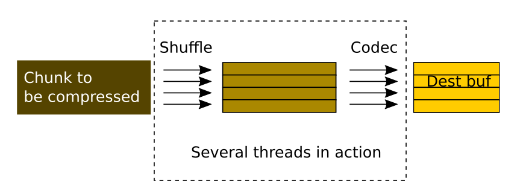

Proposal for a Multithreaded Filter Pipeline for HDF5
=====================================================

TL;DR;

This document proposes a quick way to implement support for
multithreading in the filter pipeline for HDF5.  The proposal is to
adopt the Blosc meta-compressor as the layer that coordinates the
different tasks between the HDF5 library and the codecs registered in
HDF5.

Rational
--------

Right now, HDF5 has a filter pipeline machinery that usually
works like this:


So, HDF5 receives the chunk to be compressed and sends it to the
filter pipeline sequentially.  The number of filters in the pipeline
can be as large as desired, although typically it is made of an shuffle 
filter followed by a codec (compression-decompression) filter.

Right now, this is a pure sequential process, and that means that the
different cores present in modern processors cannot be leveraged. 
Besides, we are in a moment where the storage media is getting more and
more faster, specially when accessing sequential chunks of data (the 
case for HDF5 chunked datasets), and as a consequence, the filters are
becoming more and more an important I/O bottleneck.  We would like to
improve this situation.
 
Blosc as a fast meta-compressor
-------------------------------

Blosc is a mature meta-compressor that is meant for speed. It uses SSE2
and AVX2 acceleration for a couple of filters (shuffle and bitshuffle)
and vendors a series of fast codecs that can be chosen by the user.
Also, it splits the data chunk in a series of blocks that can fit in
either L1 or L2 caches, and can use different (pre-allocated for speed)
threads to perform the different filter and compression tasks.  The
result is that it can compress data very efficiently, and sometimes
even faster than a regular memcpy() (the rational of this is that it has
to read or write less data than memcpy() over the original data chunk).

And last but not least, Blosc is more than 6 years old, so it is very 
stable and has been tested in many architectures and libraries.  It is
also open source (BSD), which makes for an easy inclusion in HDF5.

Blosc as filter driver for HDF5
-------------------------------

The proposal is that Blosc would be part of the HDF5 library so that
it could be integrated very intimately with the existing pipeline
machinery.  We are going to call this new codec 'BloscDriver' (this
can be changed).
  
The situation that we want to achieve is:



Here we see two main differences compared with the current HDF5 
operation:

* The chunks are split internally in blocks so that multithreaded 
  operation can be leveraged.
  
* The final memcpy() call is not necessary anymore.  This is utterly
  important, specially because Blosc can sometimes be faster than
  memcpy(), so this is a requisite for achieving maximum performance.

The sources of Blosc can be vendored (ideally as a git submodule) into
the HDF5 source tree to form the BloscDriver.  BloscDriver itself will
require some changes from standard Blosc (see below).  Some study is
required so as to see if these changes can be integrated in upstream
(ideally that would be the desired situation so as to avoid two 
different sources for standard Blosc and BloscDriver).

Proposed changes in HDF5 and Blosc
----------------------------------

The changes to be made in HDF5 and BloscDriver are estimated to be:
                        const unsigned int shuffle,

* Create an ID for BloscDriver that is different from the existing Blosc 
  (32001).  I'd propose to use one that is below 32000 just to transmit
  the notion that this is different than the 'user-land' Blosc.
  
* When calling the BloscDriver filter inside HDF5, instead of calling
  the typical filter function signature, the next one should be called
  instead:

  ```
    blosc_driver_filter(unsigned flags, size_t cd_nelmts,
                        const unsigned cd_values[], size_t nbytes,
                        size_t inbuf_size, void* inbuf,
                        size_t outbuf_size, void* outbuf,
                        const unsigned int shuffle)
  ```

  so, basically the same signature than usual, but with the two
  additional parameters (`outbuf_size` and `outbuf`) for the size and
  pointer to the output buffer.  This will be useful for avoiding the
  additional memcpy().  Also, a third `shuffle` parameter will be used
  to tell BloscDriver whether the SHUFFLE (1) or BITSHUFFLE (2) should
  be applied internally; a value of 0 means that no shuffle should be
  applied internally.
  
* BloscDriver will be tweaked so as to recognize the filter ID that the
  user wants to use in multithreaded mode (see below on how to specify
  it), and will call it internally (after the SHUFFLE or BITSHUFFLE 
  filter, if selected).

User operation for multithreaded filtering in HDF5
--------------------------------------------------

The user should select the 'BloscDriver' ID in `H5Pset_filter()`, and
use the first 4 `cd_values` to carry information about:

1) Whether a SHUFFLE or BITSHUFFLE filter should be used (although this
   can be inferred from the HDF5 pipeline, opinions?).

2) The filter ID for the codec to be used in combination with
   BloscDriver (even if it is going to be loaded as a dynamic filter).
 
3) The number of threads to use during BloscDriver operation.  If 0,
   the detected number of cores in the machine will be used.  If
   negative, 1 will be selected.  This can be overridden
   by the BLOSC_NTHREADS environment variable.
 
4) The size of the internal blocksize (in KB) that should be used during
   BloscDriver operation.  If not a positive number, it will be 
   computed automatically.  This can be overridden by the
   BLOSC_BLOCKSIZE environment variable.
   
In the other cd_values slots, the user will be able to set the
parameters that he is used to pass to its regular filter.  Then,
these parameters will be shifted internally by 4 and passed to the
(potentially dynamic) filter.
   
Summary
-------

With this proposal, we achieve several goals:

* HDF5 will be able to transparently use multi-threading for **any**
  registered filter.
  
* Not external HDF5 API change is needed (!).
  
* The need for the chunk memcpy() at the registered filter is much 
  alleviated now because the copy happens at the **block** level, and
  as this usually fits in L1 or L2 caches, it should be much faster than
  a regular memcpy() on a big chunk.
  
If, in addition, we create a dynamic plugin with this BloscDriver, we 
could make that the files created with this filter could be **read**
with HDF5 1.8.11 or later, as long as the plugin is publicly accessible
(we decided that this was going to be the case, right?).
